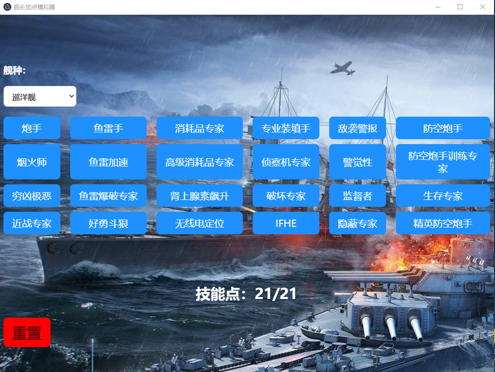

 

**0.4.0 版本发布了！** 加入“分享链接给好友”功能：分享你的加点思路，从未如此方便

 

|  | 
|:--:| 
| **基本用户界面** |

 

## 📦获取软件安装包

下载链接（0.4.0）：

*   [百度云](https://pan.baidu.com/s/1XVOXxTe7o7j38tV1KifSQQ){:target="_blank"} 提取码: t23e

 

## 🎬视频演示

 

基础功能：



 

0.4.0 新功能



 

## 📄其他信息

> 本软件完全免费，仅供学习交流使用，请勿用于商业用途😋
>
> 适用平台：Windows
> 
> 欢迎提出改进建议或者bug报告 [联系作者](./ContactMe.md)

 

## 🎮对战舰世界感兴趣？

[获取邀请码](./WOWS_invite.md)

 

 

 

* * *

Copyright &copy; 2020 Alex

Permission is hereby granted, free of charge, to any person obtaining a copy of this software and associated documentation files (the "Software"), to deal in the Software without restriction, including without limitation the rights to use, copy, modify, merge, publish, distribute, sublicense, and/or sell copies of the Software, and to permit persons to whom the Software is furnished to do so, subject to the following conditions:

The above copyright notice and this permission notice shall be included in all copies or substantial portions of the Software.

THE SOFTWARE IS PROVIDED "AS IS", WITHOUT WARRANTY OF ANY KIND, EXPRESS OR IMPLIED, INCLUDING BUT NOT LIMITED TO THE WARRANTIES OF MERCHANTABILITY, FITNESS FOR A PARTICULAR PURPOSE AND NONINFRINGEMENT. IN NO EVENT SHALL THE AUTHORS OR COPYRIGHT HOLDERS BE LIABLE FOR ANY CLAIM, DAMAGES OR OTHER LIABILITY, WHETHER IN AN ACTION OF CONTRACT, TORT OR OTHERWISE, ARISING FROM, OUT OF OR IN CONNECTION WITH THE SOFTWARE OR THE USE OR OTHER DEALINGS IN THE SOFTWARE.